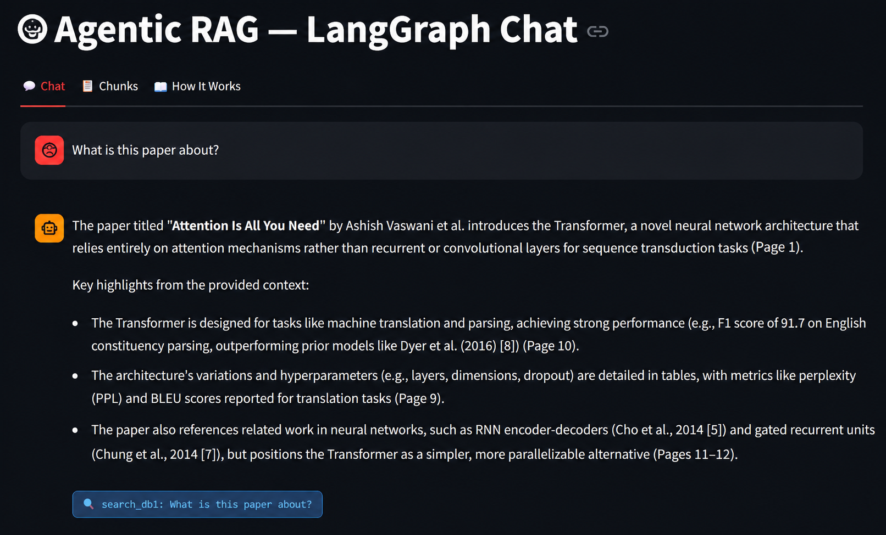
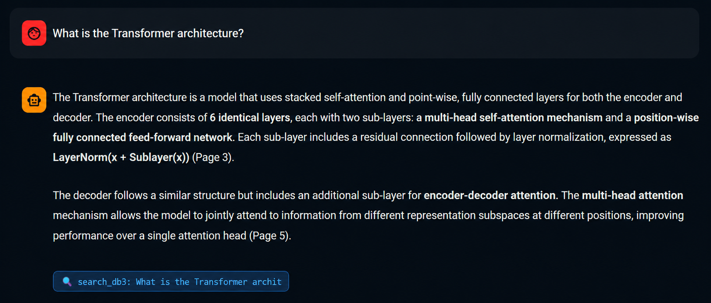
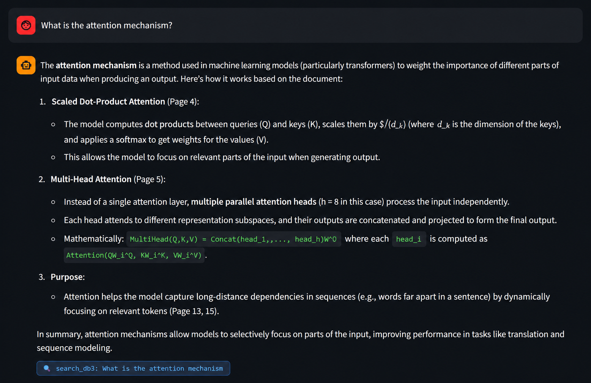
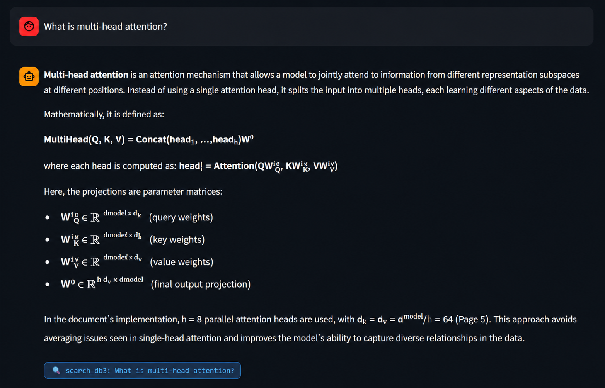
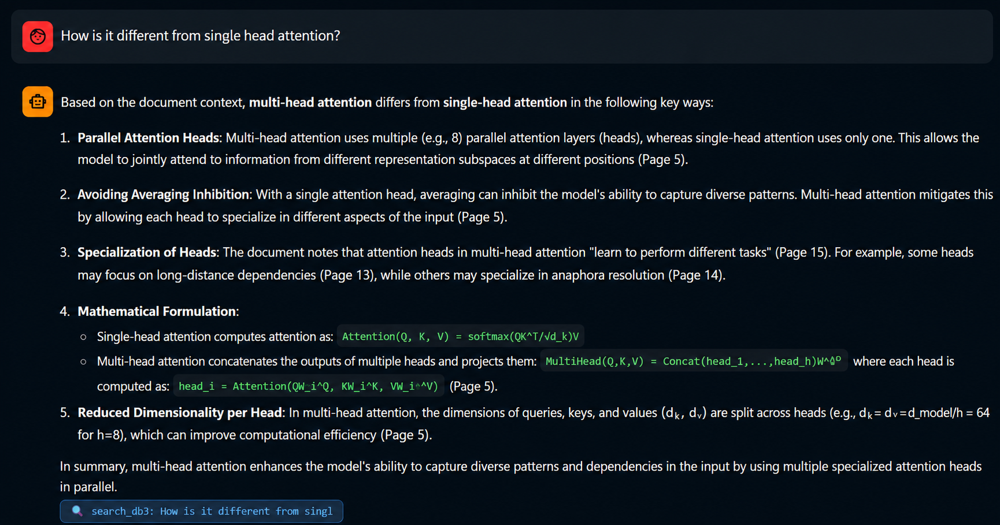
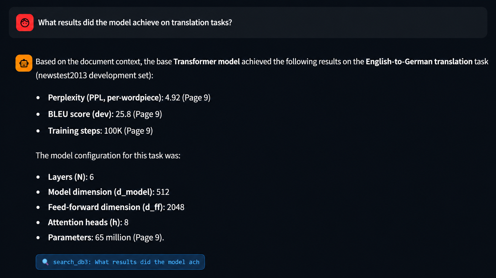
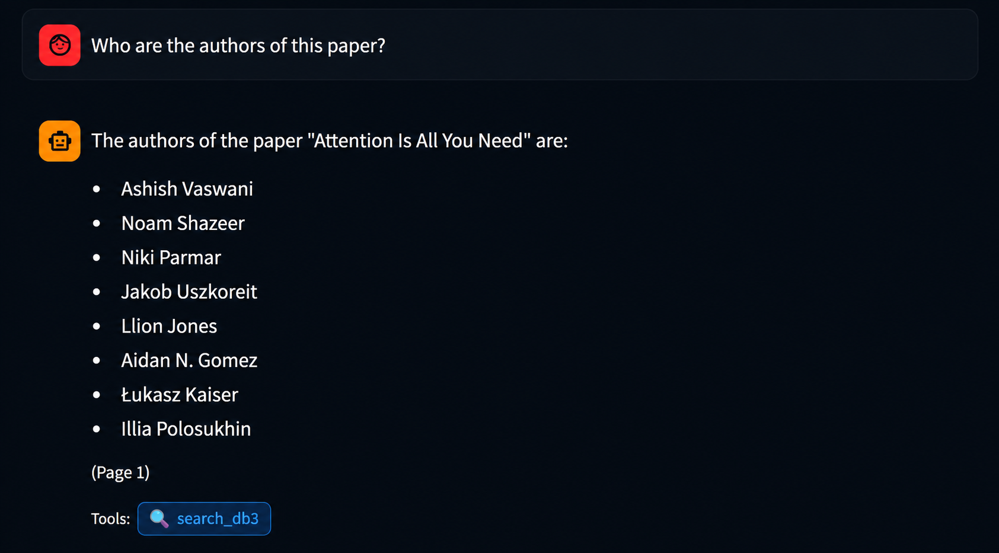

# 🤖 LangChain Agentic Vision RAG

> Vision-based PDF ingestion + LangGraph multi-database agent with tool-calling

[](https://python.org)
[](https://langchain-ai.github.io/langgraph)
[](https://streamlit.io)
[](https://console.mistral.ai)

---

## ✨ Key Features

- 📄 **Works on ANY PDF** — scanned or text-based, any language
- 👁️ **Vision-based chunking** — LLM reads page images, not raw text
- 📦 **Batch processing** — pages processed in batches of 5
- 🤖 **LangGraph agent** — StateGraph with nodes + edges (not a simple loop)
- 🗄️ **4 ChromaDB collections** — select at runtime which DB to search
- 🔀 **Mistral AI + Ollama** — switch backends with one click
- 🔄 **Retry mechanism** — failed pages retried 3 times automatically

---

## 🏗️ Architecture

```
INGESTION PIPELINE
PDF → Page Images → Batches of 5 → Vision LLM (per page)
    → chunks.json → Embeddings → ChromaDB

LANGGRAPH AGENT
START → router_node → db1 → db2 → db3 → db4 → history → generate → END
```

---

## 🚀 Setup

### Step 1: Clone
```bash
git clone https://github.com/maazzalii/langchain-agentic-vision-rag.git
cd langchain-agentic-vision-rag
```

### Step 2: Create virtual environment
```bash
python -m venv venv
# Windows:
venv\Scripts\activate
# Mac/Linux:
source venv/bin/activate
```

### Step 3: Install packages
```bash
pip install -r requirements.txt
```

### Step 4: Install Poppler (required for PDF → images)

**Windows:**
1. Download from: https://github.com/oschwartz10612/poppler-windows/releases
2. Extract to `C:\poppler\`
3. Add `C:\poppler\Library\bin` to System PATH
4. Restart terminal

**Linux:** `sudo apt install poppler-utils`
**Mac:** `brew install poppler`

### Step 5: Add your API key

Create `api.env` in the project folder:
```
MISTRAL_API_KEY=your_key_here
LLM_BACKEND=mistral
```
Get free key at: https://console.mistral.ai (no credit card)

---

## ▶️ Run

```bash
streamlit run app.py
```

---

## 💬 How to Use

1. Select **Mistral** in sidebar → paste API key
2. Select target database (DB1–DB4)
3. Upload PDF → click **Ingest PDF**
4. Click **Initialize LangGraph Agent**
5. Start chatting in the Chat tab

---

## 📁 Project Structure

```
langchain-agentic-vision-rag/
├── app.py              → Streamlit Web UI
├── config.py           → Settings (models, paths)
├── ingestion.py        → PDF → Images → Vision LLM → ChromaDB
├── langgraph_agent.py  → LangGraph StateGraph agent
├── mistral_client.py   → Mistral API (no SDK needed)
├── main.py             → CLI interface
├── requirements.txt    → Python dependencies
├── setup.bat           → Windows auto-setup
├── api.env             → Your API key (NOT in GitHub)
├── .env.example        → Template for api.env
└── assets/
    └── screenshots/    → App screenshots
```

---

## 🛠️ Tech Stack

| Component | Technology |
|-----------|-----------|
| Web UI | Streamlit |
| Agent Framework | **LangGraph** (StateGraph) |
| Vision LLM | Mistral Pixtral / LLaVA |
| Embeddings | mistral-embed / nomic-embed-text |
| Agent LLM | mistral-small-latest / mistral |
| Vector DB | ChromaDB (4 collections) |
| PDF → Images | pdf2image + Poppler |

---

## 🤖 LangGraph vs Custom Agent

| Feature | Custom Agent (old) | **LangGraph (this)** |
|---------|-------------------|----------------------|
| Architecture | Manual for loop | StateGraph nodes+edges |
| Databases | 1 only | **4 collections** |
| State management | Manual list | **AgentState TypedDict** |
| Routing | Hardcoded | **LLM-powered router node** |
| Industry standard | No | **Yes** |

---

## 📸 Screenshots

> Tested on **"Attention Is All You Need"** — the famous Transformer paper  
> by Vaswani et al. (2017) — a 15-page research PDF with math equations,  
> tables, and technical content.

---

### 1️⃣ Paper Overview — What is this paper about?
The agent correctly identifies the paper, authors, and key contributions  
with accurate page citations.



---

### 2️⃣ Transformer Architecture
Detailed explanation of encoder-decoder structure with page citations.



---

### 3️⃣ Key Concept — Attention Mechanism
The agent explains Scaled Dot-Product Attention and Multi-Head Attention  
including mathematical formulas extracted from the paper.



---

### 4️⃣ Multi-turn Conversation — Part 1
First turn: asking about multi-head attention with full math formulas.



---

### 5️⃣ Multi-turn Conversation — Part 2
Follow-up question showing conversation history — agent remembers context  
from the previous turn without re-searching.



---

### 6️⃣ Model Results on Translation Tasks
Specific numerical results (BLEU scores, PPL, parameters) accurately  
retrieved with exact page citations.



---

### 7️⃣ Tool Calling Badge — Authors
Shows the LangGraph agent using `search_db3` tool to retrieve  
the exact list of 8 authors from Page 1.



---

## 👨‍💻 Author

**Maaz Ali** — CS Student @ NUML Islamabad
- GitHub: [@maazzalii](https://github.com/maazzalii)
- LinkedIn: [maazzalii](https://linkedin.com/in/maazzalii)

---

## 📄 License

MIT License — free to use and modify
